# PropertyLah AI — Technical Architecture & System Design

**Version:** 1.0  
**Date:** 2026-08-23  
**Author:** PropertyLah AI engineering team  

---

## 1. High-Level System Architecture

PropertyLah AI is a **Next.js 16 + FastAPI** application with an AI agent layer that can run in two modes:

- **Demo mode** — fully client-side, deterministic, zero credentials.
- **Live mode** — server-side Qwen/Hermes agent, Supabase persistence, real channel integrations.

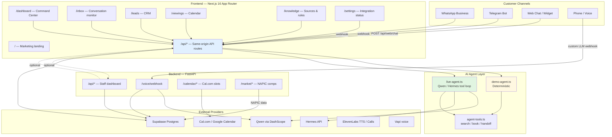

---

## 2. Deployment Architecture

### Production layout

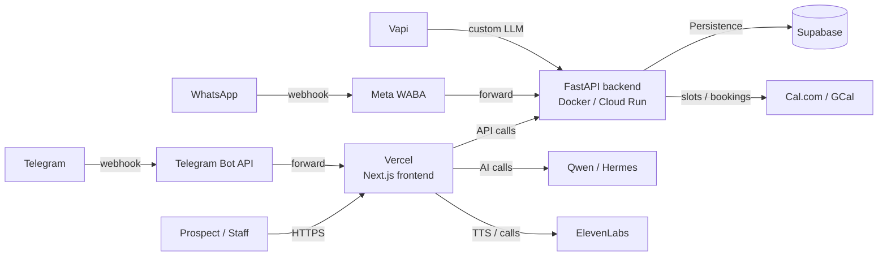

### Demo / pitch deployment

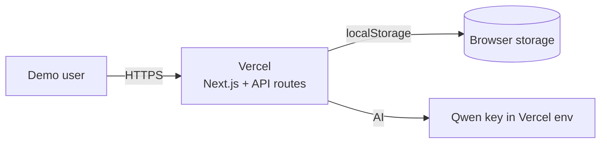

In demo mode, the entire application can be hosted on **Vercel only** — no backend or database is required. The browser persists demo state in `localStorage`.

---

## 3. Frontend Architecture

### Tech stack

| Layer | Technology |
|-------|------------|
| Framework | Next.js 16.3.2 (App Router) |
| UI | React 19, TypeScript, Tailwind CSS |
| Icons | Lucide React |
| State | localStorage (demo) / Server state (live) |
| Package manager | npm |

### Route map

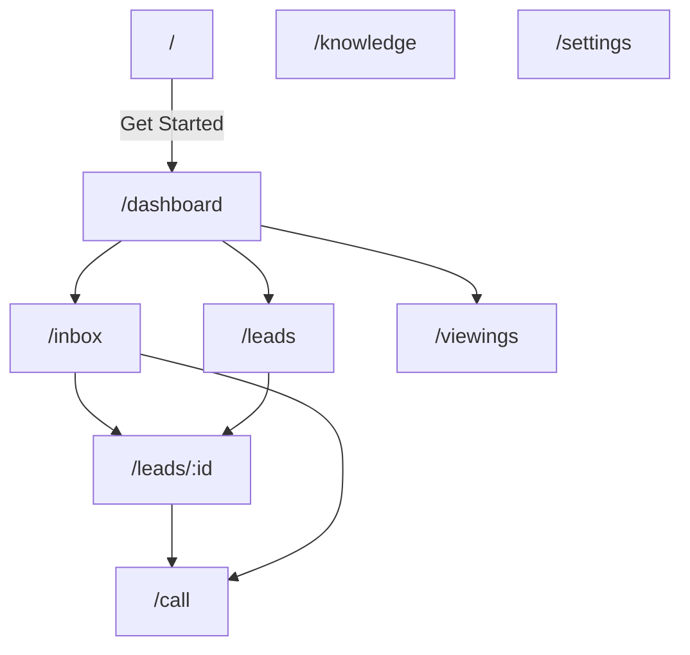

### API route surface

All routes live under `frontend/app/api/`:

| Method | Route | Purpose |
|--------|-------|---------|
| GET | `/api/health` | Mode and provider status |
| POST | `/api/agent/chat` | Main AI agent response |
| POST | `/api/web/chat` | Web channel chat |
| POST | `/api/listings/search` | Search inventory |
| GET / POST | `/api/viewings` | List / create viewings |
| GET | `/api/viewings/slots` | Available slots |
| GET | `/api/leads` | List leads |
| GET / PATCH | `/api/leads/:id` | Read / update lead |
| POST | `/api/leads/:id/call-request` | Record call request |
| GET / POST / PATCH / DELETE | `/api/knowledge/sources` | Knowledge CRUD |
| POST | `/api/knowledge/test` | Test knowledge query |
| GET / POST / PATCH / DELETE | `/api/agent/rules` | Rule CRUD |
| POST | `/api/telegram/webhook` | Telegram bot webhook |
| POST | `/api/tts` | Text-to-speech proxy |

---

## 4. AI Agent Architecture

### Agent loop

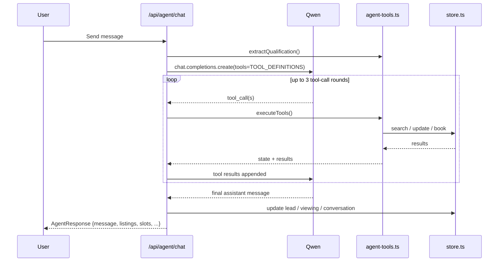

### Tool definitions

| Tool | Function |
|------|----------|
| `search_listings` | Match inventory by budget, location, bedrooms, type |
| `get_viewing_slots` | Return next available slots for a listing |
| `create_viewing` | Book a slot and update CRM |
| `get_lead` | Load current lead profile |
| `update_lead` | Update qualification fields |
| `search_knowledge` | Query knowledge base / rules |
| `get_active_rules` | Return enabled agent rules |
| `request_call` | Record AI or human call request |
| `handoff_to_human` | Escalate to human agent |

### Agent response structure

```typescript
interface AgentResponse {
  message: string;              // human-readable reply
  sessionId: string;
  leadId?: string;
  qualification?: Qualification;
  leadScore?: number;
  leadStatus?: LeadStatus;
  conversationStatus?: ConversationStatus;
  listings?: Listing[];         // matched listings
  suggestedSlots?: ViewingSlot[];
  viewing?: Viewing;            // confirmed booking
  sourcesUsed?: SourceCitation[];
  rulesApplied?: RuleAudit[];
  actions?: AgentAction[];
  nextBestAction?: string;
  handoffRequired?: boolean;
  error?: string;
}
```

---

## 5. Backend Architecture (FastAPI)

### Tech stack

| Layer | Technology |
|-------|------------|
| Framework | FastAPI |
| Runtime | Python 3.11 |
| Database | Supabase (Postgres) |
| AI client | OpenAI SDK → Qwen via DashScope |
| Container | Docker |
| Deployment | Docker Compose / Cloud Run / EC2 |

### Service modules

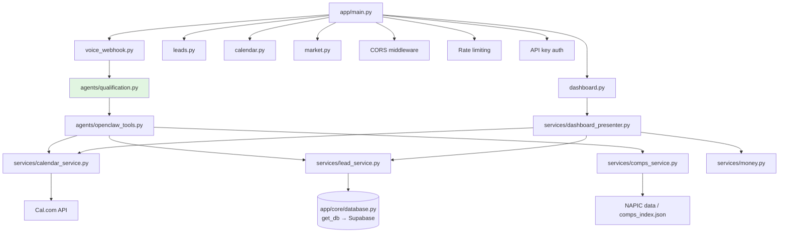

### Voice call flow

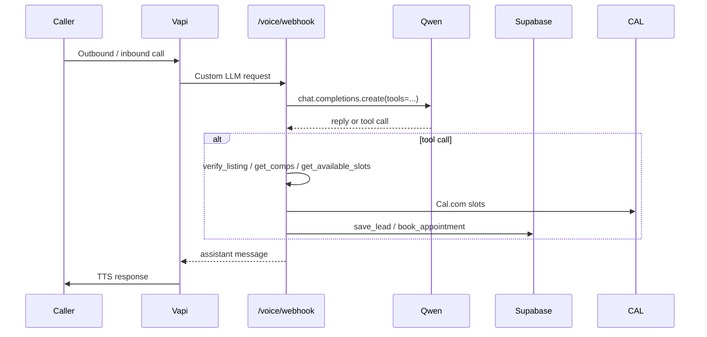

---

## 6. Data Model

### Supabase schema

```sql
create table if not exists keynest_leads (
    id text primary key,
    data jsonb not null default '{}'::jsonb,
    updated_at timestamptz default now()
);

create table if not exists keynest_viewings (
    id text primary key,
    data jsonb not null default '{}'::jsonb,
    updated_at timestamptz default now()
);

create table if not exists keynest_knowledge_sources (
    id text primary key,
    data jsonb not null default '{}'::jsonb,
    updated_at timestamptz default now()
);

create table if not exists keynest_agent_rules (
    id text primary key,
    data jsonb not null default '{}'::jsonb,
    updated_at timestamptz default now()
);
```

### Backend voice schema (separate FastAPI database)

```sql
create table leads (
    id uuid primary key default gen_random_uuid(),
    caller_phone text,
    caller_name text,
    lead_type text,
    budget_range text,
    preferred_area text,
    timeline text,
    language text,
    qualification_score int,
    status text,
    property_reference text,
    listing_verified boolean,
    notes text,
    vapi_call_id text,
    appointment_at timestamptz,
    booking_uid text,
    created_at timestamptz default now(),
    updated_at timestamptz default now()
);

create table call_logs (
    id uuid primary key default gen_random_uuid(),
    lead_id uuid references leads(id),
    vapi_call_id text,
    transcript text,
    started_at timestamptz,
    ended_at timestamptz
);

create table messages (
    id uuid primary key default gen_random_uuid(),
    lead_id uuid references leads(id),
    sender text,
    channel text,
    content text,
    metadata jsonb,
    created_at timestamptz default now()
);
```

---

## 7. Demo vs Live Mode

### Mode switching logic

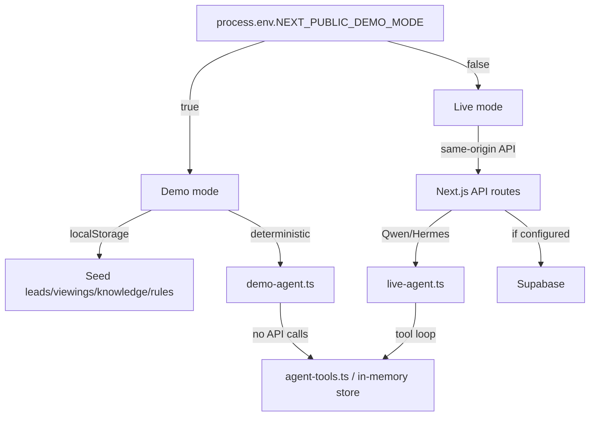

### Environment variables

```bash
# Frontend / Next.js
NEXT_PUBLIC_DEMO_MODE=true
NEXT_PUBLIC_API_BASE_URL=        # optional external backend
NEXT_PUBLIC_DASHBOARD_API_KEY=   # shared key for /api/* routes in live mode

# Server-only (never NEXT_PUBLIC_)
QWEN_API_KEY=
QWEN_BASE_URL=https://dashscope-intl.aliyuncs.com/compatible-mode/v1
QWEN_MODEL=qwen-plus
HERMES_API_URL=
HERMES_API_KEY=

SUPABASE_URL=
SUPABASE_SERVICE_ROLE_KEY=
SUPABASE_ANON_KEY=

TELEGRAM_BOT_TOKEN=
TELEGRAM_WEBHOOK_SECRET=

ELEVENLABS_API_KEY=
ELEVENLABS_MODEL_ID=eleven_multilingual_v2
ELEVENLABS_VOICE_ID=
ELEVENLABS_VOICE_ID_EN=
ELEVENLABS_VOICE_ID_MS=
ELEVENLABS_AGENT_ID=
ELEVENLABS_PHONE_NUMBER_ID=
ELEVENLABS_PROVIDER=twilio

VAPI_WEBHOOK_SECRET=
GOOGLE_CALENDAR_ID=
GOOGLE_CLIENT_ID=
GOOGLE_CLIENT_SECRET=

# Backend / FastAPI
SUPABASE_URL=
SUPABASE_SERVICE_KEY=            # backend uses this key name
DASHBOARD_API_KEY=               # must match NEXT_PUBLIC_DASHBOARD_API_KEY
DASHBOARD_REQUIRE_AUTH=true
FRONTEND_ORIGINS=http://localhost:3000
RATE_LIMIT_ENABLED=true
RATE_LIMIT_WEBHOOK_PER_MINUTE=60
RATE_LIMIT_DASHBOARD_PER_MINUTE=120
CAL_API_KEY=
CAL_EVENT_TYPE_ID=
OPENCLAW_API_KEY=
OPENCLAW_BASE_URL=
```

---

## 8. Security Model

### Secrets handling

- All AI provider, database, and channel tokens are **server-only**.
- `NEXT_PUBLIC_DASHBOARD_API_KEY` is the only secret intentionally exposed to the browser (a stopgap shared-key auth).
- `QWEN_API_KEY`, `SUPABASE_SERVICE_ROLE_KEY`, `TELEGRAM_BOT_TOKEN`, `ELEVENLABS_API_KEY` never use `NEXT_PUBLIC_` prefix.

### Auth & rate limiting

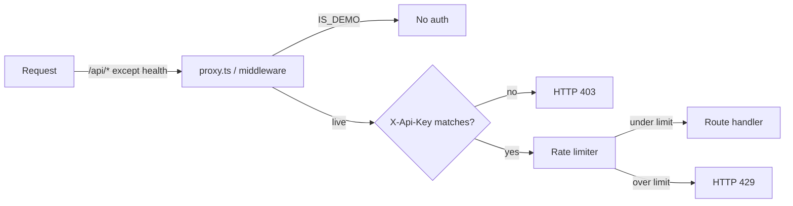

### Backend auth

- FastAPI `dashboard.py` uses `require_dashboard_auth` dependency.
- `FRONTEND_ORIGINS` explicit CORS allowlist; no wildcard.
- Per-IP rate limiting for webhooks and dashboard routes.

---

## 9. Channel Integration Architecture

### WhatsApp

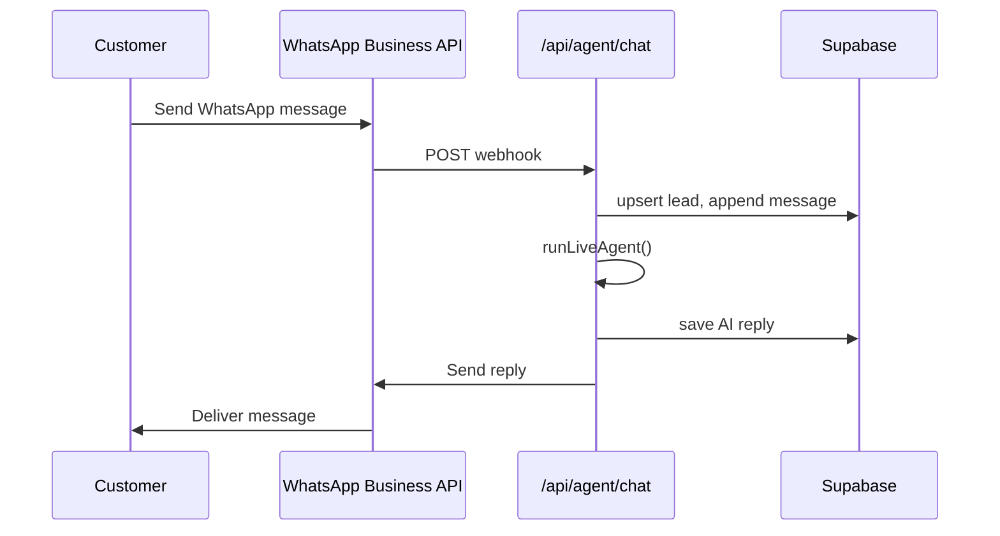

### Telegram

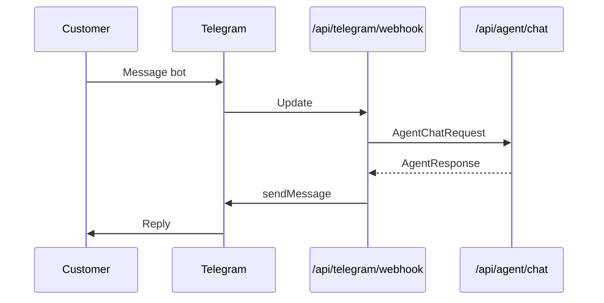

### Web chat

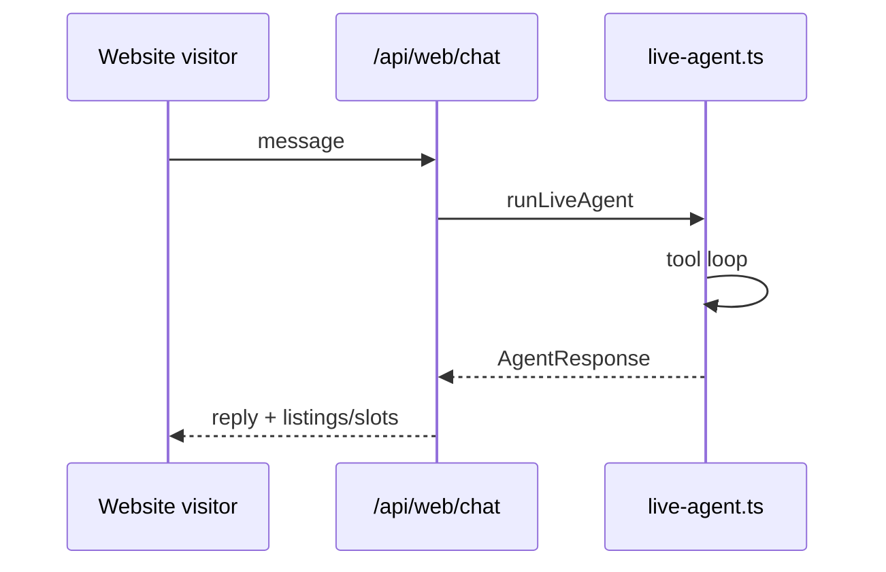

### Voice (Vapi)

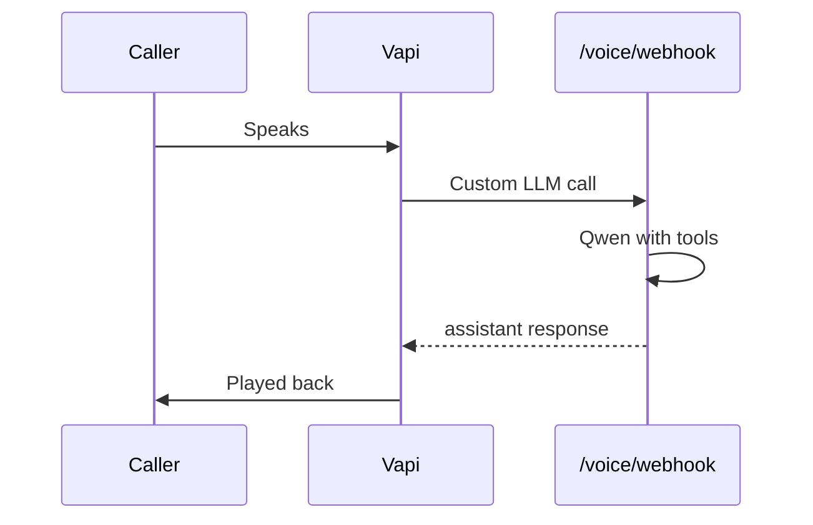

---

## 10. Scalability & Performance

### Current limits

| Resource | Limit | Note |
|----------|-------|------|
| Rate limit agent | 30 req/min/IP | Per-process; cost control for Qwen |
| Rate limit dashboard | 120 req/min/IP | Per-process |
| Lead list | 200 per page | `GET /api/leads?limit=&offset=` |
| Aggregate scan | 1,000 leads | Dashboard overview / viewings |
| Conversation context | last 10 messages | Sent to Qwen to stay within context |

### Scaling path

1. **Move rate limiting to Redis/Upstash** for multi-instance deployments.
2. **Add DB-side counts** for dashboard aggregates instead of scanning 1,000 rows.
3. **Separate AI worker** from Next.js API routes for heavy agent calls.
4. **CDN + edge caching** for marketing landing page.
5. **Database indexes** on `status`, `score`, `appointment_at`, `created_at`.

---

## 11. Monitoring & Observability

### Health endpoint

`GET /api/health` returns:

```json
{
  "ok": true,
  "mode": "demo",
  "qwenConfigured": false,
  "hermesConfigured": false,
  "supabaseConfigured": false,
  "telegramConfigured": false,
  "elevenLabsConfigured": false
}
```

### Logs

- `console.warn` on Hermes failures.
- `logger.exception` on backend transcript/message load failures.
- No secrets logged.

### Metrics to add

- Agent response latency (p50, p95)
- Tool-call success/failure rates
- Lead conversion funnel
- Human handoff rate
- Cost per conversation (Qwen tokens)

---

## 12. Development & Build

### Frontend commands

```bash
cd frontend
npm install
npm run dev        # port 3000
npm run build
npm run typecheck
npm run lint
```

### Backend commands

```bash
cd backend
python -m venv venv
source venv/bin/activate
pip install -r requirements.txt
uvicorn app.main:app --host 0.0.0.0 --port 8000
```

### Docker

```bash
docker compose up --build
```

---

## 13. Decision Log

| Decision | Rationale |
|----------|-----------|
| Next.js API routes for agent | Single deploy target for demo; simplifies Vercel hosting. |
| Separate FastAPI backend | Voice webhooks and Cal.com integration need a long-running backend. |
| JSONB in Supabase | Flexible schema while product-market fit is being validated. |
| Qwen via OpenAI SDK | DashScope is OpenAI-compatible; reuse existing SDK. |
| localStorage in demo mode | Zero credentials, instant pitch, no backend required. |
| Shared `DASHBOARD_API_KEY` | Stopgap auth until real staff login/RBAC is built. |
| Explicit CORS allowlist | Lead PII; wildcard would allow any site to fetch dashboard data. |

---

## 14. Related Documents

- `docs/PRD.md` — Product requirements
- `docs/PITCH.md` — Pitch one-pager
- `README.md` — Setup and quick start
- `AGENTS.md` — Contributor notes
- `frontend/INTEGRATION.md` — API contract
