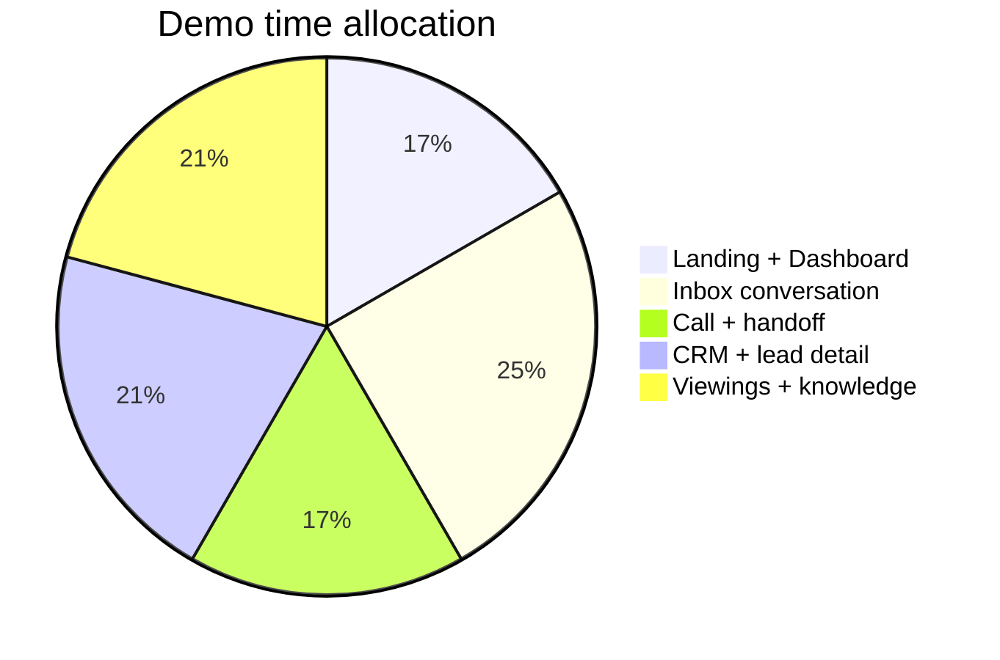

# PropertyLah AI — Demo Script & Judge Click Path

**Version:** 1.0  
**Date:** 2026-08-23  
**Demo mode:** `NEXT_PUBLIC_DEMO_MODE=true`  
**Estimated time:** 4–5 minutes  

---

## Demo Overview

This script walks a judge or investor through the core value proposition of PropertyLah AI:

1. **Instant replies** — the AI concierge qualifies leads 24/7.
2. **Smart match** — it searches the agency's own inventory.
3. **Hands-free booking** — viewings are scheduled in the chat.
4. **Human handoff** — complex deals escalate to a real agent.
5. **Agency control** — staff monitor and manage everything from one dashboard.

---

## Pre-Demo Checklist

```bash
cd frontend
npm install
NEXT_PUBLIC_DEMO_MODE=true npm run dev
# open http://localhost:3000
```

Or use the deployed Vercel URL.

Confirm:

- [ ] Build passes: `npm run build`
- [ ] Landing page loads at `/`
- [ ] Dashboard loads at `/dashboard`
- [ ] Aisha lead is visible in inbox

---

## Demo Flow

### Step 1 — Landing page & hook (30s)

**URL:** `/`

**What to say:**
> "This is PropertyLah AI, a WhatsApp-first property concierge for Malaysian agents. It qualifies leads, matches listings, and books viewings while the agent is busy."

**What to show:**
- Hero section: "Turn your WhatsApp leads into booked viewings."
- Animated chat mock showing Aisha conversation.
- Stats: 24/7, < 2 min setup, < 30s first response, 4.9/5.

**Click:** **Get Started Today**

---

### Step 2 — Dashboard / Command Center (30s)

**URL:** `/dashboard`

**What to say:**
> "When the agent logs in, they see a command center. New leads, qualified leads, viewings booked, hot leads, and first response time."

**What to show:**
- 5 metric cards.
- Activity feed.
- Lead pipeline.
- Attention needed card.
- Recent bookings card.
- Badge: "WhatsApp Demo" or "WhatsApp Connected" depending on mode.

**Highlight:** Aisha Rahman is already Hot with a booked viewing.

**Click:** **Open Inbox**

---

### Step 3 — Inbox & conversation (90s)

**URL:** `/inbox`

**What to say:**
> "This is the unified inbox. WhatsApp, Telegram, and web chat all land here. Let's open Aisha's conversation."

**Click:** **Aisha Rahman**

**What to show in the chat:**

1. Aisha sends: *"Hi, I'm looking for a 3-bedroom condo near KLCC. Budget around RM 600k."*
2. AI asks about timeline and financing.
3. Aisha replies: *"3 months, loan approved."*
4. AI returns 2 listing cards with prices, beds, baths, and area.
5. AI asks: *"Want to view this Saturday?"*
6. Aisha picks 2pm.
7. AI confirms: *"Booked! Saturday 2pm at Residensi Harmoni."*

**Point out:**
- Listing cards are source-cited.
- Slot picker is interactive.
- Agent score updated to Hot.
- Conversation status: "AI handling".

---

### Step 4 — Request AI call (30s)

**What to say:**
> "If the lead wants to talk, they can request an AI or human call."

**Type in chat:** `CALL`

**What to show:**
- AI offers to arrange a call.
- **Request AI Call** button appears.
- Clicking it opens `/call?leadId=aisha-rahman`.
- In demo mode the call page shows a simulated voice call with browser speech recognition.

---

### Step 5 — Human handoff (30s)

**What to say:**
> "For complex or sensitive questions, the AI hands over to a human agent."

**Type in chat:** `human agent`

**What to show:**
- AI says it is handing over.
- Conversation status changes to **human_handling**.
- Staff can now take over from the dashboard.

---

### Step 6 — Leads CRM (30s)

**URL:** `/leads`

**What to say:**
> "Every lead is scored and tracked in the CRM. Hot, Warm, Nurture."

**What to show:**
- Searchable table.
- Filters by status, score, intent.
- Aisha Rahman at the top, status `booked`, score `Hot`.

**Click:** Aisha's row → `/leads/:id`

---

### Step 7 — Lead detail & audit (45s)

**URL:** `/leads/aisha-rahman`

**What to say:**
> "This is the full picture for one lead: transcript, AI summary, qualification, timeline, and every source or rule the AI used."

**What to show:**
- AI summary: "Loan-approved buyer, KLCC, 3-bed, RM 600k, viewing booked."
- Qualification card: budget, area, bedrooms, financing, timeline.
- Timeline events: inquiry → qualification → listing match → viewing booked → call requested.
- Source citations and rule audit chips.
- **Take over** and **Request AI call** controls.

---

### Step 8 — Viewings calendar (30s)

**URL:** `/viewings`

**What to say:**
> "All viewings booked by the AI land here. Agents can switch between list and calendar."

**What to show:**
- Calendar view with color-coded chips.
- Confirmed vs pending viewings.
- Aisha's Saturday 2pm booking.

---

### Step 9 — Knowledge base & rules (45s)

**URL:** `/knowledge`

**What to say:**
> "Agencies upload price lists, FAQs, and policies. The AI answers from these sources, not the internet. They can also set rules like 'do not guarantee availability'."

**What to show:**
- Knowledge sources list (seed data).
- Agent rules list.
- Test query box.

**Demo query:** *"What is the booking fee for Residensi Harmoni?"*

**What to show:**
- AI answer.
- Cited source.
- Rule applied (e.g. "Do not guarantee availability").

---

### Step 10 — Settings & integrations (15s)

**URL:** `/settings`

**What to say:**
> "This page shows which integrations are live. Right now we are in demo mode, but with Qwen, Supabase, WhatsApp, Telegram, and ElevenLabs configured, it switches to live."

**What to show:**
- Operating mode: Demo.
- AI Agent: Demo.
- WhatsApp: Demo.
- Telegram: Configured / Not configured.
- Storage: Demo.

---

## Closing Line

**What to say:**
> "PropertyLah AI turns every WhatsApp message into a qualified, scored, booked lead — and gives the agency full control. We are demo-ready today and can switch to live mode with a Qwen key and WhatsApp number."

---

## Demo Timing



| Step | Time | Cumulative |
|------|------|------------|
| 1. Landing page | 0:30 | 0:30 |
| 2. Dashboard | 0:30 | 1:00 |
| 3. Inbox conversation | 1:30 | 2:30 |
| 4. AI call | 0:30 | 3:00 |
| 5. Human handoff | 0:30 | 3:30 |
| 6. Leads CRM | 0:30 | 4:00 |
| 7. Lead detail | 0:45 | 4:45 |
| 8. Viewings | 0:30 | 5:15 |
| 9. Knowledge | 0:45 | 6:00 |
| 10. Settings | 0:15 | 6:15 |

---

## Backup Demo State

If demo data gets corrupted:

1. Go to `/dashboard`.
2. Click **Reset demo data**.
3. Refresh the page.

Or run in browser console:

```javascript
localStorage.removeItem('keynest-leads-v2');
localStorage.removeItem('keynest-viewings-v1');
localStorage.removeItem('keynest-knowledge-sources-v1');
localStorage.removeItem('keynest-agent-rules-v1');
location.reload();
```

---

## Live Mode Switch

To show real AI during the pitch:

```bash
# frontend/.env.local
NEXT_PUBLIC_DEMO_MODE=false
QWEN_API_KEY=<your-key>
QWEN_BASE_URL=https://dashscope-intl.aliyuncs.com/compatible-mode/v1
QWEN_MODEL=qwen-plus
```

Restart the dev server. The agent will now call Qwen for real replies. Keep demo mode as the default for reliability.

---

## FAQ for Judges

**Q: Is this real WhatsApp?**  
A: Demo mode is a simulation. Live mode connects to WhatsApp Business Platform, Telegram, and web chat.

**Q: Does it work in Bahasa Malaysia?**  
A: Yes, the agent detects the user's language and replies in English, Bahasa Malaysia, or Manglish.

**Q: Where is the data stored?**  
A: Demo mode uses browser localStorage. Live mode uses Supabase Postgres.

**Q: Can the AI make mistakes?**  
A: It only searches approved agency inventory and cited knowledge sources. For high-risk questions it hands off to a human.

**Q: How does the agency control it?**  
A: Staff dashboard for monitoring, take-over, knowledge uploads, rules, and settings.
