# PropertyLah AI — Diagram Library

A single reference page of all architecture, flow, and data diagrams for pitch and technical reviews.

---

## 1. System Architecture

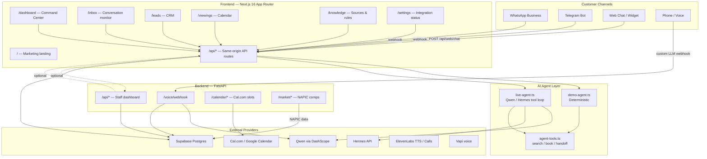

---

## 2. Agent Chat Sequence

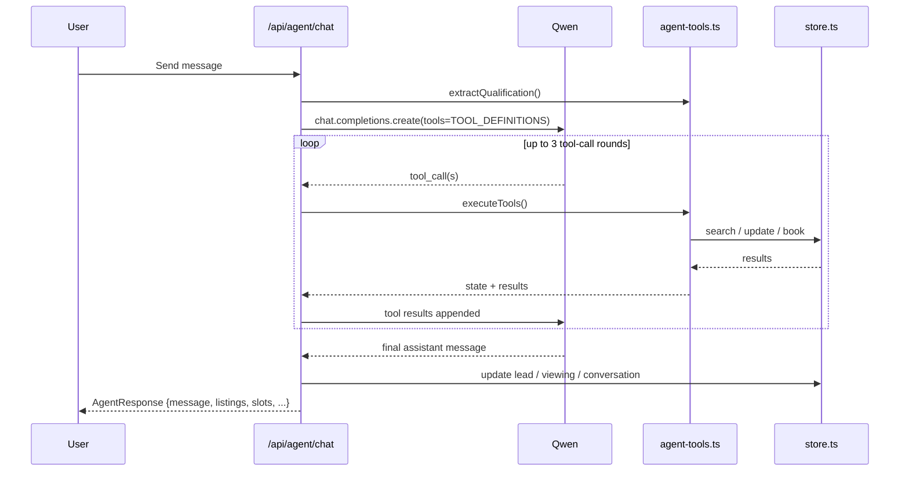

---

## 3. Demo vs Live Mode

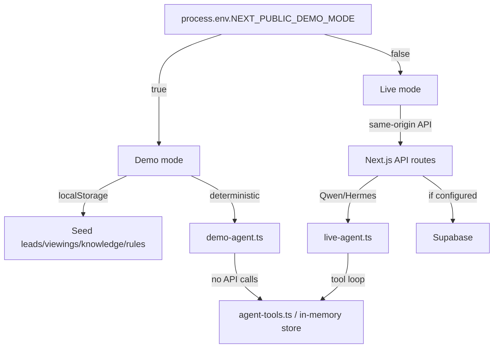

---

## 4. Data Model

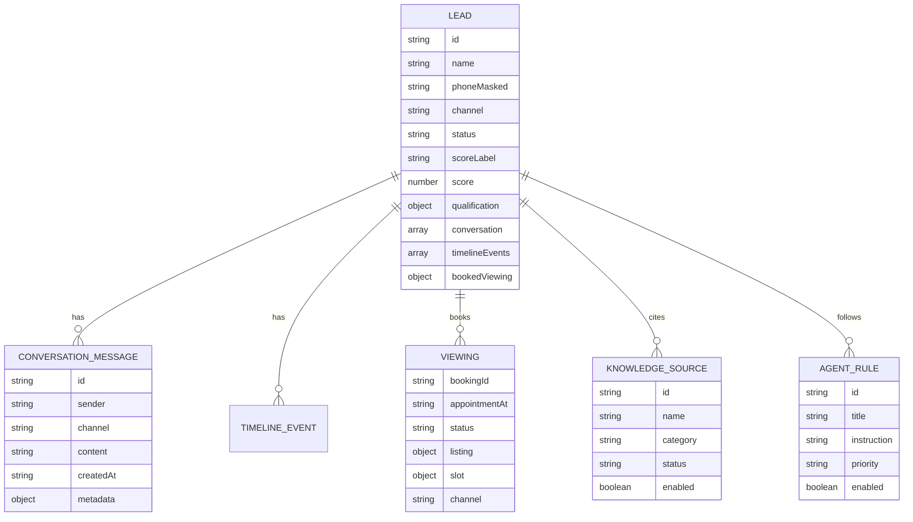

---

## 5. Conversation Flow

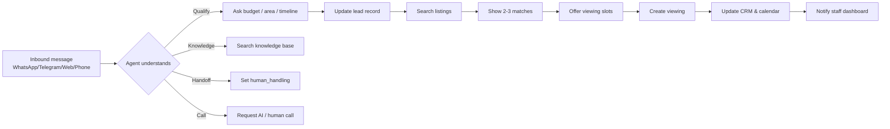

---

## 6. WhatsApp Integration Flow

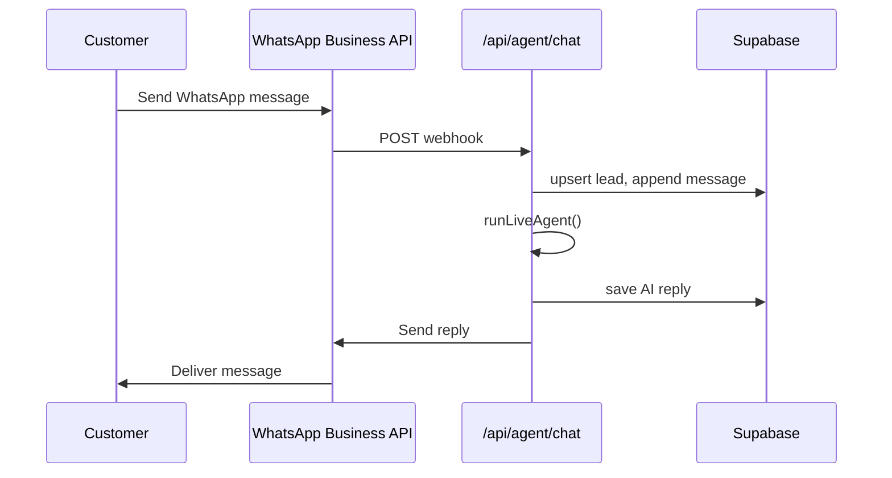

---

## 7. Telegram Integration Flow

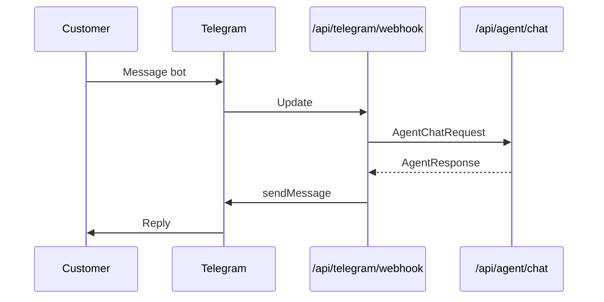

---

## 8. Voice Call Flow (Vapi)

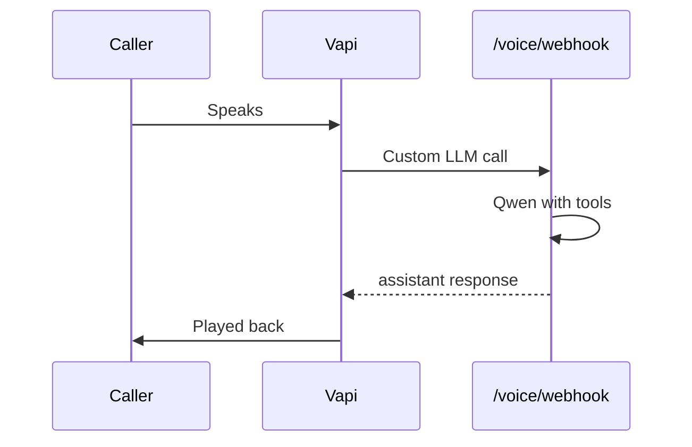

---

## 9. Auth & Rate Limiting

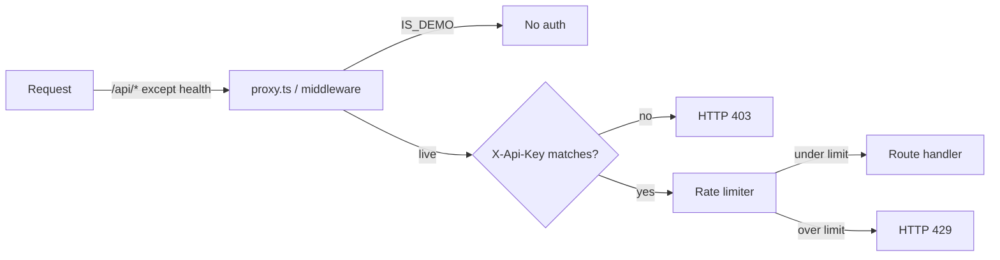

---

## 10. Roadmap Gantt

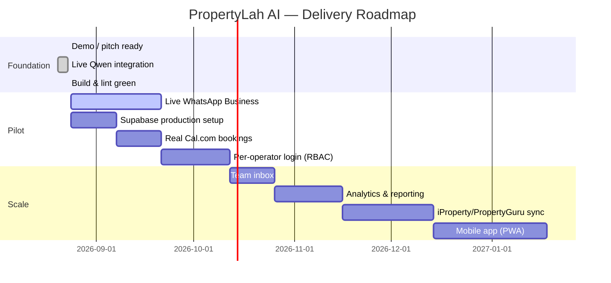

---

## 11. Pitch Value Flow

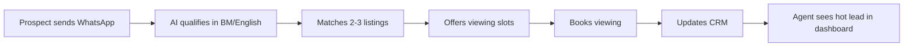

---

## 12. Deployment (Demo)

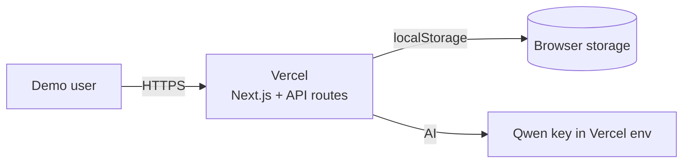

---

## 13. Deployment (Production)

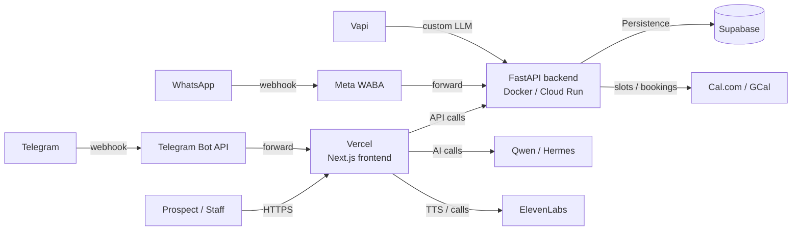

---

## Notes

- All diagrams are written in Mermaid syntax and render in GitHub, GitLab, Notion, and VS Code extensions.
- For slide decks, use a Mermaid-to-PNG/SVG exporter or screenshot from a Markdown preview.
