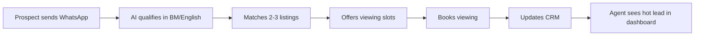
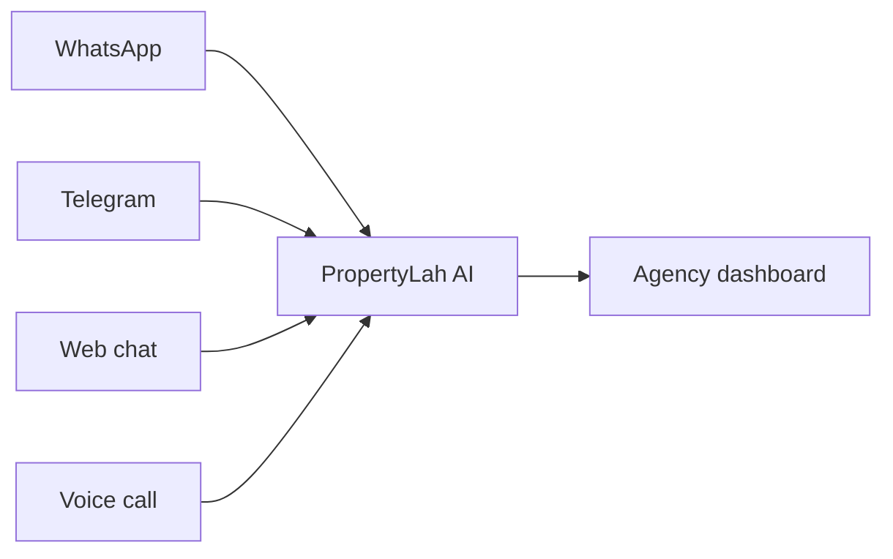
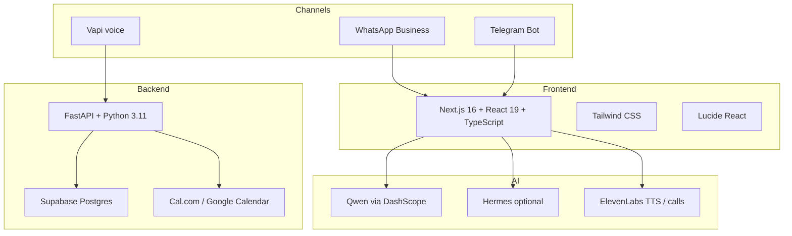
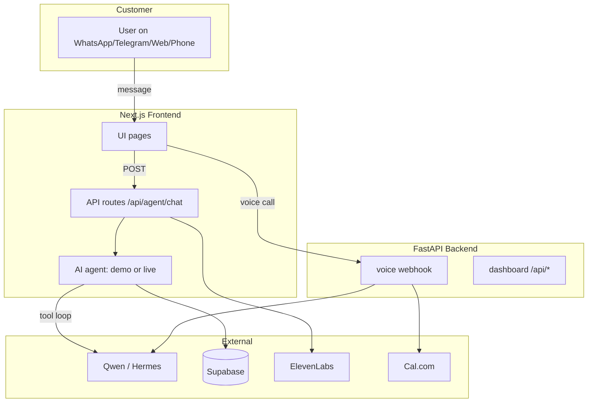

# PropertyLah AI — Pitch Deck (One-Pager)

**Tagline:** Malaysia's WhatsApp-first AI property concierge.  
**One-liner:** An AI agent that qualifies leads, matches listings, and books viewings over WhatsApp, Telegram, and web chat — in English or Bahasa Malaysia, 24/7.  
**Status:** Demo-ready, live Qwen/Hermes integration verified, pitch-ready deployment.  

---

## The Problem

Malaysian property agents lose leads every day:

- **Slow replies:** Prospects message at night or during viewings. The agent who replies first usually wins.
- **Wasted calls:** Most enquiries are unqualified — wrong budget, wrong area, no financing.
- **Lost context:** WhatsApp chats live on one phone, CRM on another, viewings in a third app.
- **Language gap:** Many prospects prefer Bahasa Malaysia, but templated replies feel robotic.

---

## The Solution

**PropertyLah AI** is a WhatsApp-first AI concierge + internal dashboard for property agencies.

### What it does

1. **Qualifies automatically** — budget, area, bedrooms, timeline, financing.
2. **Matches listings** — from the agency's own inventory, with source citations.
3. **Books viewings** — offers slots and confirms in the chat.
4. **Escalates smartly** — hands off to a human for complex or sensitive questions.
5. **Speaks Malaysian** — English, Bahasa Malaysia, Manglish.
6. **Monitors everything** — one dashboard for leads, viewings, and knowledge.

---

## Product Snapshot

### Customer channels

### Dashboard pages

| Page | Purpose |
|------|---------|
| **/** | Marketing landing page with pricing & testimonials |
| **/dashboard** | Command center: metrics, hot leads, recent bookings |
| **/inbox** | Unified WhatsApp/Telegram/web conversation monitor |
| **/leads** | Searchable CRM with lead scores and filters |
| **/leads/:id** | Full transcript, AI summary, timeline, source/rule audit |
| **/viewings** | List + calendar view of booked viewings |
| **/knowledge** | Upload price lists, FAQs, policies, rules |
| **/settings** | Live integration status |

---

## Live Demo Flow

**Works with zero credentials. Judges can run it end-to-end in 2 minutes.**

1. Open `/` → marketing landing page → **Get Started**.
2. `/dashboard` → see Aisha lead marked **Hot**.
3. `/inbox` → click **Aisha Rahman**.
4. View the seeded WhatsApp conversation:
   - Qualification
   - 2 listing cards
   - Viewing slot picker
   - Confirmed booking
5. Type **"CALL"** → request an AI call.
6. Type **"human agent"** → see handoff flow.
7. `/leads` → click Aisha → full timeline and audit.
8. `/viewings` → see the booking in the calendar.
9. `/knowledge` → test a query and see source/rule chips.

**Demo mode:** deterministic, runs in `localStorage`, no backend.  
**Live mode:** set `NEXT_PUBLIC_DEMO_MODE=false` + Qwen API key for real AI replies.

---

## Tech Stack

| Layer | Technology |
|-------|------------|
| Frontend | Next.js 16.3.2, React 19, TypeScript, Tailwind CSS |
| AI | Qwen (OpenAI-compatible), Hermes, function-calling tool loop |
| Database | Supabase (JSONB schema) |
| Backend | FastAPI, Python 3.11, Docker |
| Voice | Vapi custom LLM, ElevenLabs TTS/outbound calls |
| Channels | WhatsApp Business, Telegram Bot, Web chat |
| Deployment | Vercel (frontend), Docker/Cloud Run (backend) |

---

## Competitive Advantage

| Feature | PropertyLah AI | Generic chatbot | Human-only agency |
|---------|---------------|-----------------|-------------------|
| 24/7 instant reply | ✅ | ✅ | ❌ |
| Bahasa Malaysia + rojak | ✅ | ⚠️ | ✅ |
| Malaysia listing match | ✅ | ❌ | ✅ |
| Source-cited answers | ✅ | ❌ | varies |
| Viewing booking | ✅ | ❌ | manual |
| Human handoff | ✅ | ❌ | ✅ |
| Agency knowledge base | ✅ | ⚠️ | ✅ |
| Demo-first, deploys in minutes | ✅ | ❌ | ❌ |

**Moat:**
- Built for Malaysian real-estate workflows (qualification, viewing, handoff).
- Cites agency sources and rules, so answers stay accurate.
- Demo-first: agencies can try before integrating live channels.

---

## Business Model

| Plan | Price | Best for |
|------|-------|----------|
| **Starter** | RM 49/month | Solo agents, 500 AI replies, 1 WhatsApp number |
| **Pro** | RM 99/month | Growing agents, 10,000 replies, knowledge base, API |
| **Agency** | RM 249/month | Teams, unlimited replies, team inbox, custom integrations |

**Revenue drivers:**
- Monthly SaaS subscriptions.
- WhatsApp Business API message fees passed through.
- Voice call minutes (ElevenLabs/Vapi).
- Onboarding and custom integration services.

---

## Traction & Status

| Milestone | Status |
|-----------|--------|
| Marketing landing page | ✅ Live |
| Demo mode (full Aisha flow) | ✅ Passing |
| Qwen live integration | ✅ Verified |
| Telegram webhook | ✅ Implemented |
| Supabase schema + connection | ✅ Ready |
| FastAPI backend + voice | ✅ Core routes |
| ElevenLabs TTS / call page | ✅ Implemented |
| Dashboard auth + rate limiting | ✅ Implemented |
| Build, typecheck, lint | ✅ Passing |
| Vercel deployment | ✅ Ready |

---

## Architecture at a Glance

---

## The Ask

**We are raising / seeking:**

- Pilot agency partners in KL/Selangor to run live WhatsApp integration.
- Introductions to WhatsApp Business API providers (360dialog, Wati, etc.).
- Feedback on pricing and team/RBAC needs.
- Engineering collaboration on voice-to-CRM workflow.

**Next 90 days:**
1. Land 3 pilot agencies.
2. Connect live WhatsApp Business accounts.
3. Launch real viewing booking with Cal.com.
4. Build per-operator login and team inbox.

---

## Why Now

- **WhatsApp is the default** property search channel in Malaysia.
- **AI cost has dropped** — Qwen and open models make this economically viable.
- **Agencies are drowning** in inbound messages but cannot hire enough assistants.
- **No local competitor** combines WhatsApp + listing match + viewing booking + human handoff in one product.

---

## Appendix: Pitch Metrics

| KPI | Current | Target |
|-----|---------|--------|
| First response time | < 30 s (demo) | < 30 s (live) |
| Lead qualification rate | 100% in demo flow | 80% in live |
| Viewing booking automation | End-to-end in demo | Real Cal.com booking |
| Languages supported | EN + BM | EN + BM + Mandarin |
| Channels | 4 (WhatsApp, Telegram, Web, Phone) | + SMS, FB Messenger |

---

**Contact:** hello@propertylah.ai  
**Demo:** https://frontend-kappa-green-22.vercel.app  
**Repo:** https://github.com/timothylee58/virtual-property-agent-my
