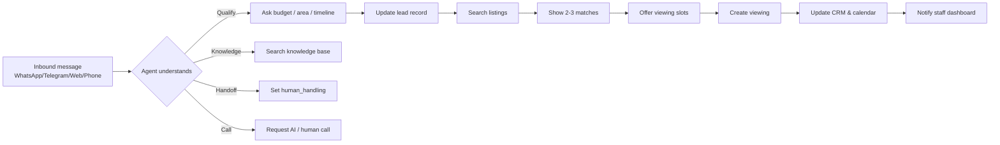
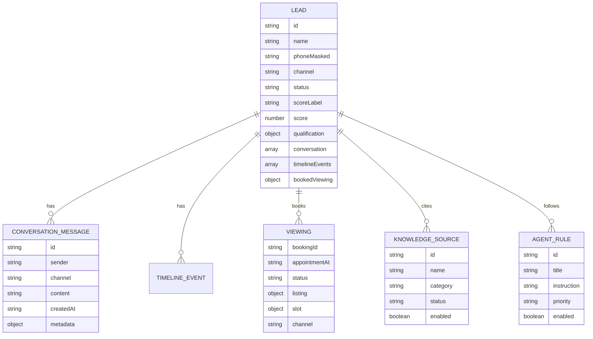

# PropertyLah AI — Product Requirements Document

**Version:** 1.0  
**Date:** 2026-08-23  
**Status:** Pitch / demo-ready  
**Author:** PropertyLah AI team  

---

## 1. Executive Summary

PropertyLah AI is a **WhatsApp-first AI property concierge** for Malaysian real-estate agencies. It qualifies leads, matches listings, books viewings, and escalates to human agents — 24/7 in English and Bahasa Malaysia — while giving agency staff a unified dashboard to monitor and take over conversations.

The product is designed to be **demo-first**: a fully deterministic demo runs with no credentials, while the same code base can be switched to live mode by adding Qwen/Hermes, Supabase, WhatsApp Business, Telegram, ElevenLabs, and calendar integrations.

### In one sentence
> An AI agent that turns WhatsApp property enquiries into booked viewings and a scored CRM, while letting agencies control the conversation from a modern dashboard.

---

## 2. Problem Statement

Malaysian property agents lose leads because:

1. **Slow replies** — Prospects message after hours; the first responsive agent usually wins.
2. **Poor qualification** — Agents waste time on unqualified enquiries instead of hot leads.
3. **Manual CRM entry** — Conversation context is lost when agents copy-paste into spreadsheets.
4. **No unified view** — WhatsApp, Telegram, web chat, and phone leads live in different silos.
5. **Language friction** — Many prospects prefer Bahasa Malaysia or Manglish, but templated replies feel robotic.

### Target market

- Solo property agents in KL/Selangor/Penang/Johor
- Small-to-medium property agencies
- New-project marketing agencies handling high inbound volume
- Voice-first agencies that also want a WhatsApp/web channel

### Personas

| Persona | Role | Goal | Pain |
|---------|------|------|------|
| **Ahmad, the solo agent** | Runs his own listings on WhatsApp | Qualify more leads while showing properties | Misses messages while driving / in viewings |
| **Siti, agency owner** | Manages 5–10 negotiators | See which leads are hot and who needs follow-up | No visibility into WhatsApp conversations |
| **Michelle, team lead** | Distributes leads to her team | Hand off complex deals to senior agents | Escalations are manual and ad-hoc |
| **The prospect (Aisha)** | Buyer/renter on WhatsApp/Telegram | Get fast, accurate info and book viewings | Gets ignored, slow replies, wrong listings |

---

## 3. Product Vision & Goals

### Vision
Become the default AI concierge layer for every Malaysian property agency, handling the first 90% of every enquiry and handing the last 10% to a human at exactly the right moment.

### Goals

| # | Goal | Metric |
|---|------|--------|
| G1 | Reduce first-response time | < 30 seconds on WhatsApp/Telegram/Web |
| G2 | Qualify leads automatically | 80% of leads have budget, area, timeline, financing captured |
| G3 | Increase viewing booking rate | 2x more viewings per inbound lead vs. manual |
| G4 | Reduce manual CRM work | 90% of lead updates happen automatically |
| G5 | Support Malaysian languages | English + Bahasa Malaysia + Manglish in same thread |

---

## 4. Core Features

### 4.1 AI-powered multi-channel conversations

- Channels: **WhatsApp**, **Telegram**, **Web chat**, **phone (voice)**.
- The agent replies as "Sara" (PropertyLah AI).
- One question at a time qualification: budget, financing, area, property type, bedrooms, timeline.
- Automatically detects language and replies in English or Bahasa Malaysia.
- Rich message types: text, listing cards, slot pickers, booking confirmations, handoff notices.

### 4.2 Smart listing match

- Search agency inventory by budget, location, bedrooms, property type.
- Returns top 2–3 listings with images, price, and key details.
- Cites the source listing; never invents facts.

### 4.3 Viewing booking

- Offers available time slots.
- Confirms the chosen slot.
- Updates CRM and viewings calendar.
- Optional: real calendar event creation via Google Calendar or Cal.com.

### 4.4 Lead scoring & CRM

- Score 0–100 based on qualification completeness.
- Labels: Hot (≥80), Warm (60–79), Nurture (<60).
- Statuses: new, qualified, booked, nurture.
- Conversation statuses: ai_handling, human_handling, closed.
- Timeline events: inquiry, qualification, listing match, viewing booked, call requested, handover.

### 4.5 Human handoff

- Lead says "human agent" or asks a high-risk legal/finance question.
- Agent escalates to human_handling and updates the dashboard.
- Staff can take over the conversation in the Inbox.

### 4.6 AI call escalation

- Lead requests an AI or human call.
- In demo mode: opens the browser voice call page (`/call`).
- In live mode: ElevenLabs outbound call or Vapi browser voice (when configured).

### 4.7 Knowledge base & agent rules

- Upload documents: price lists, FAQs, agency policies, market data.
- Configure agent rules: compliance, escalation, booking, language.
- Test queries show which sources and rules the agent used.
- Agent cites sources and rules in every response.

### 4.8 Internal dashboard

- **Dashboard** `/dashboard`: metrics, attention list, recent bookings, activity feed.
- **Inbox** `/inbox`: monitor all WhatsApp/Telegram/web conversations.
- **Leads** `/leads`: searchable CRM with filters and scores.
- **Lead detail** `/leads/:id`: full transcript, AI summary, timeline, source/rule audit.
- **Viewings** `/viewings`: list and calendar view of booked viewings.
- **Knowledge** `/knowledge`: upload sources and manage rules.
- **Settings** `/settings`: integration status and mode.

### 4.9 Demo mode (zero credentials)

- Runs entirely in the browser with `localStorage`.
- Deterministic agent responses for reliable pitch demos.
- Seeded Aisha WhatsApp flow: inquiry → qualification → 2 listings → slot picker → booking → Hot lead.

---

## 5. Functional Requirements

### 5.1 Conversation flows

### 5.2 Agent capabilities

| Capability | Tool / Function | Trigger |
|------------|-----------------|---------|
| Qualify lead | `update_lead` | Any new budget/area/timeline info |
| Match listing | `search_listings` | Lead has budget + area |
| Offer slots | `get_viewing_slots` | Lead asks to view |
| Book viewing | `create_viewing` | Lead picks a slot |
| Answer FAQ | `search_knowledge` | Brochure / policy / facility question |
| Request call | `request_call` | Lead says "call" or "CALL" |
| Handoff | `handoff_to_human` | "human agent" or high-risk question |

### 5.3 Data model

### 5.4 Channels

| Channel | Status in demo | Live integration |
|---------|---------------|------------------|
| WhatsApp | Simulated UI | WhatsApp Business Platform webhooks |
| Telegram | Simulated UI | Telegram Bot API + webhook |
| Web chat | Simulated | `POST /api/web/chat` |
| Phone / voice | Simulated call page | Vapi / ElevenLabs |

---

## 6. Non-Functional Requirements

### 6.1 Performance

- First response time: < 30 seconds in demo; < 5 seconds in live (model dependent).
- Dashboard page load: < 2 seconds.
- API routes: < 500 ms for CRUD; < 3 s for agent chat.

### 6.2 Security & privacy

- All API keys and service-role tokens are **server-only**.
- No `NEXT_PUBLIC_` prefix for Qwen, Hermes, Supabase, WhatsApp, Telegram, ElevenLabs secrets.
- Phone numbers masked in dashboard (`+60 12-**** 6789`).
- Dashboard API routes gated by `X-Api-Key` in live mode.
- Rate limiting per IP for agent and dashboard routes.
- CORS allowlist on backend, not wildcard.

### 6.3 Reliability

- Demo mode works offline with no backend.
- Live mode returns **honest HTTP errors** (503) when AI provider is missing, never silently falls back to demo data.
- Supabase persistence optional; localStorage fallback only in demo.

### 6.4 Scalability

- Next.js frontend deployable to Vercel.
- FastAPI backend containerised with Docker.
- Supabase for production persistence.
- Rate limiting in-memory per process; migrate to Redis for multi-instance.

### 6.5 Compliance

- AI never guarantees loan approval, investment returns, rental yield, price growth, legal or tax outcomes.
- Voice calls disclose recording for quality/training.
- Human handoff available at any time.

---

## 7. User Stories

### Agent / staff

1. **As an** agency owner, **I want** to see all WhatsApp leads in one inbox **so that** I know which hot leads need follow-up.
2. **As an** agent, **I want** the AI to qualify prospects before I call **so that** I only spend time on serious buyers.
3. **As a** team lead, **I want** to take over a conversation from the AI **so that** I can close complex deals.
4. **As an** admin, **I want** to upload my price list and FAQs **so that** the AI quotes accurate information.

### Prospect

5. **As a** buyer, **I want** to ask for a 3-bedroom condo under RM 600k in KL **so that** I get matching listings in seconds.
6. **As a** renter, **I want** to book a viewing slot over WhatsApp **so that** I don't have to call during office hours.
7. **As a** BM speaker, **I want** to chat in Bahasa Malaysia **so that** I feel comfortable asking questions.
8. **As a** lead, **I want** to speak to a human **so that** I can discuss financing or legal concerns safely.

---

## 8. Success Metrics & KPIs

| Metric | Baseline | Target | How measured |
|--------|----------|--------|--------------|
| First response time | 2–24 hours | < 30 s | `/api/health` + conversation timestamps |
| Lead qualification rate | 30% manual | 80% auto | `qualification` object completeness |
| Viewing booking rate | 5% | 10% | `viewings` / `leads` ratio |
| Hot lead identification | Manual | Auto score ≥ 80 | `scoreLabel == "Hot"` |
| Human handoff rate | N/A | < 15% | `conversationStatus == "human_handling"` |
| Agent time saved | 0 | 5 hrs/week | CRM auto-updates + auto-qualification |

---

## 9. Release Criteria

### MVP (current)

- [x] Marketing landing page
- [x] Demo mode with full Aisha WhatsApp flow
- [x] Inbox, leads, lead detail, viewings, knowledge, settings
- [x] AI qualification, listing match, viewing booking
- [x] Human handoff and call request
- [x] Knowledge sources and agent rules
- [x] Live Qwen/Hermes integration
- [x] Telegram webhook
- [x] ElevenLabs TTS / outbound call stubs
- [x] Supabase schema and persistence
- [x] Dashboard auth and rate limiting
- [x] Settings page with live integration status

### Live mode go-live checklist

- [ ] WhatsApp Business Platform phone number provisioned and webhook set
- [ ] Qwen or Hermes API key configured and tested
- [ ] Supabase project created and `keynest_schema.sql` applied
- [ ] Dashboard API key set in Vercel and backend
- [ ] Rate limits tuned to expected traffic
- [ ] Privacy policy and recording disclosure live on landing page
- [ ] Staff training on handoff and takeover workflow

---

## 10. Risks & Mitigations

| Risk | Impact | Mitigation |
|------|--------|------------|
| WhatsApp Business API approval delays | High | Fallback to Telegram + web chat; demo-first pitch |
| Qwen/Hermes hallucinates listings | High | Tool-calling + mandatory `search_listings`; source citations |
| Lead PII exposed in dashboard | High | Mask phone numbers; server-only keys; auth/rate limits |
| AI gives financial/legal advice | Medium | Hard-coded rules; `handoff_to_human` for high-risk queries |
| Multi-instance rate limit gaps | Medium | Move to Redis/Upstash before scaling |
| Demo feels too scripted | Low | Live Qwen integration can be enabled for real replies |

---

## 11. Open Questions & Future Roadmap

### Open questions

1. Which WhatsApp Business API provider will be used? (Meta direct, 360dialog, Wati, etc.)
2. Will the product support SMS/MMS in addition to WhatsApp?
3. What is the target pricing for production?
4. Do we need a native mobile app for agents, or is the web dashboard sufficient?

### Roadmap

| Phase | Time | Features |
|-------|------|----------|
| **P0 — Demo / Pitch** | Now | Deterministic demo, landing page, Qwen live integration |
| **P1 — Live WhatsApp** | +4 weeks | WhatsApp Business webhooks, real message delivery, production Supabase |
| **P2 — Voice & Calls** | +8 weeks | Vapi/ElevenLabs outbound calls, browser voice call, call transcripts in CRM |
| **P3 — Calendar & Notifications** | +12 weeks | Google/Cal.com real bookings, reminders, owner/agent notifications |
| **P4 — Team & RBAC** | +16 weeks | Per-operator login, role-based access, team inbox, analytics |
| **P5 — Portal Integrations** | +24 weeks | iProperty / PropertyGuru listing sync, web chat widget, SDK |

---

## 12. Appendix: Glossary

| Term | Definition |
|------|------------|
| **Sara** | PropertyLah AI concierge persona |
| **Lead score** | 0–100 score derived from budget, area, timeline, financing, viewing intent |
| **Hot/Warm/Nurture** | Lead score buckets for prioritisation |
| **Channel** | WhatsApp, Telegram, web, or phone |
| **Agent rule** | A configurable instruction the AI must follow (compliance, escalation, etc.) |
| **Knowledge source** | An uploaded document the AI can cite (price list, FAQ, policy, market data) |
| **Handoff** | Transfer of conversation from AI to human agent |

---

## 13. Related Documents

- `README.md` — Quick start and setup
- `AGENTS.md` — Engineering notes for contributors
- `frontend/INTEGRATION.md` — Backend & channel API contract
- `docs/ARCHITECTURE.md` — Technical system design
- `docs/PITCH.md` — Pitch one-pager
