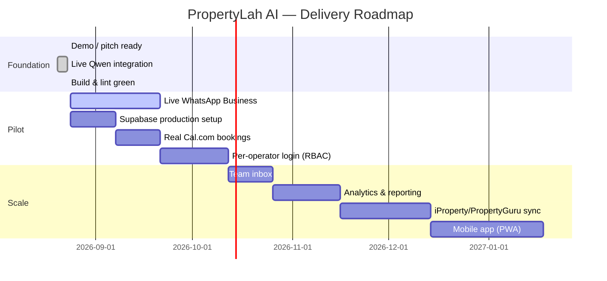
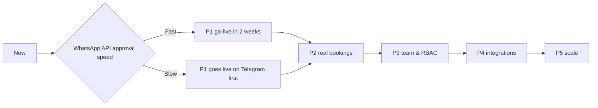

# PropertyLah AI — Product Roadmap

**Version:** 1.0  
**Date:** 2026-08-23  

---

## Roadmap Timeline

---

## Phases

### P0 — Demo / Pitch (Now)

**Goal:** Win pitch/judge demo and get pilot agency interest.

- Marketing landing page
- Deterministic demo mode (Aisha flow)
- Dashboard pages: dashboard, inbox, leads, viewings, knowledge, settings
- Live Qwen/Hermes integration
- Telegram webhook
- ElevenLabs TTS / call page
- Supabase schema + connection
- Build, typecheck, lint passing
- Vercel deployment ready

**Deliverable:** Working demo URL + PRD + pitch one-pager.

---

### P1 — Live WhatsApp Pilot (Weeks 1–4)

**Goal:** One real agency handling customer WhatsApp enquiries end-to-end.

- WhatsApp Business Platform phone number provisioning
- Meta webhook integration (`POST /api/whatsapp/webhook`)
- Real message send/receive
- Supabase production persistence
- Phone number PII masking in dashboard
- Basic handoff to human agent in production
- Error handling and retry for failed message delivery

**Milestones:**

| Week | Deliverable |
|------|-------------|
| 1 | WABA account + phone number approved |
| 2 | Webhook + message receive working |
| 3 | Agent replies with listing match in live mode |
| 4 | Agency pilot go-live with handoff |

---

### P2 — Voice & Real Bookings (Weeks 5–8)

**Goal:** Book real viewings and handle inbound voice calls.

- Cal.com integration for slot availability and bookings
- Google Calendar fallback
- Vapi voice agent fully wired to backend
- ElevenLabs outbound calls from dashboard
- Call transcripts stored in CRM
- Reminder messages before viewings

**Milestones:**

| Week | Deliverable |
|------|-------------|
| 5 | Cal.com slot fetch + booking API |
| 6 | Viewing reminders via WhatsApp/Telegram |
| 7 | Vapi inbound call flow stable |
| 8 | ElevenLabs outbound call from lead detail |

---

### P3 — Team & RBAC (Weeks 9–12)

**Goal:** Multi-agent agency adoption.

- Per-operator login (Supabase Auth or Clerk)
- Role-based access: admin, agent, viewer
- Team inbox with assignment
- Conversation notes and @mentions
- Lead reassignment
- Audit log for every action

---

### P4 — Analytics & Integrations (Weeks 13–20)

**Goal:** Agencies see ROI and operational insight.

- Analytics dashboard: response time, conversion, handoff rate
- Cost tracking per conversation
- CSV export for leads and viewings
- iProperty / PropertyGuru listing sync
- Web chat widget embed code
- Zapier / Make.com integration
- Open API for custom integrations

---

### P5 — Scale (Weeks 21+)

**Goal:** Platform-level features for large agencies.

- Multi-office / multi-brand support
- White-label option
- Mobile app / PWA for agents
- Advanced lead scoring with ML
- A/B testing agent prompts
- Dedicated support tier
- Marketplace for third-party integrations

---

## Feature Backlog

### High priority

| # | Feature | Phase |
|---|---------|-------|
| 1 | Live WhatsApp Business integration | P1 |
| 2 | Cal.com / Google Calendar real bookings | P2 |
| 3 | Per-operator login and RBAC | P3 |
| 4 | Voice call transcripts in CRM | P2 |
| 5 | Reminder messages | P2 |
| 6 | Analytics dashboard | P4 |
| 7 | Listing portal sync | P4 |

### Medium priority

| # | Feature | Phase |
|---|---------|-------|
| 8 | Web chat widget for agency websites | P4 |
| 9 | SMS channel | P5 |
| 10 | Mandarin language support | P4 |
| 11 | Mobile PWA | P5 |
| 12 | AI call quality scoring | P5 |

### Low priority / nice to have

| # | Feature | Phase |
|---|---------|-------|
| 13 | Voice cloning for agency agents | P5 |
| 14 | AI-generated property descriptions | P4 |
| 15 | Market price prediction | P5 |
| 16 | Native iOS/Android app | P5 |

---

## Risk-Adjusted Roadmap

---

## Success Criteria by Phase

| Phase | Criteria |
|-------|----------|
| P0 | Demo runs end-to-end with no credentials; Qwen live mode works. |
| P1 | 1 agency handles 50+ real WhatsApp leads with < 30s first response. |
| P2 | 20% of qualified leads book a real viewing automatically. |
| P3 | 3+ agents in one agency can use team inbox without collisions. |
| P4 | Agency can report ROI: cost per lead, cost per viewing, conversion rate. |
| P5 | 10+ agencies on platform, white-label option available. |

---

## Notes

- Roadmap assumes WhatsApp Business API is the primary channel.
- Telegram and web chat can serve as fallback channels if WhatsApp approval is delayed.
- Voice (Vapi/ElevenLabs) is a differentiator but not required for product-market fit.
- RBAC and per-operator login are gating requirements for team/agency plans.
